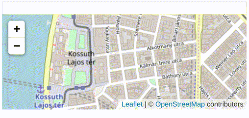

# OSM Picker

Small library that turns an input field into a GPS picker using only [Leaflet](https://leafletjs.com).

This project doesn't try to be exhaustive in providing a library that can be used everywhere. The goal is to provide a nice, easy to understand library boilerplate that you can modify to create a customized one for your own use.



## Install

Include Leaflet JS&CSS and the [minified](dist/osmpicker.min.js) or [unminfied version of `osmpicker.js`](src/osmpicker.js)

```html
<head>
  <link href="https://unpkg.com/leaflet@1.6.0/dist/leaflet.css" rel="stylesheet">
</head>
<body>
  <script src="https://unpkg.com/leaflet@1.6.0/dist/leaflet.js"></script>
  <script src="osmpicker.js"></script>
</body>
```

## Usage

Create an input element with an id and call the lib on it:

```js
<input type="text" id="location">
<script>
  new OsmPicker({
    selector: 'location',
    defaultView: {
      latLng: ['47.50737', '19.04611'],
      zoom: 5,
    }
  });
</script>
```

For greater flexibility you can pass an input element and an output element where the map should be rendered:

```js
<input type="text" id="location">
<div id="location-map" style="height:300px;cursor:crosshair;"></div>
<script>
  new OsmPicker({
    inputElement: document.getElementById('location'),
    mapElement: document.getElementById('location-map'),
    defaultView: {
      latLng: ['47.50737', '19.04611'],
      zoom: 5,
    }
  });
</script>
```


If the input has a GPS value in it, it will preselected that on the map:

```js
<input type="text" id="location" value="47.486980809455176,19.046259276129007">
```

## Live examples

- [Id based example](https://dekvidet.github.io/osm-picker/demos/id.html)
- [Element based example](https://dekvidet.github.io/osm-picker/demos/element.html)
- [Preselect example](https://dekvidet.github.io/osm-picker/demos/preselect.html)

## License

Licensed under [MIT](LICENSE)
